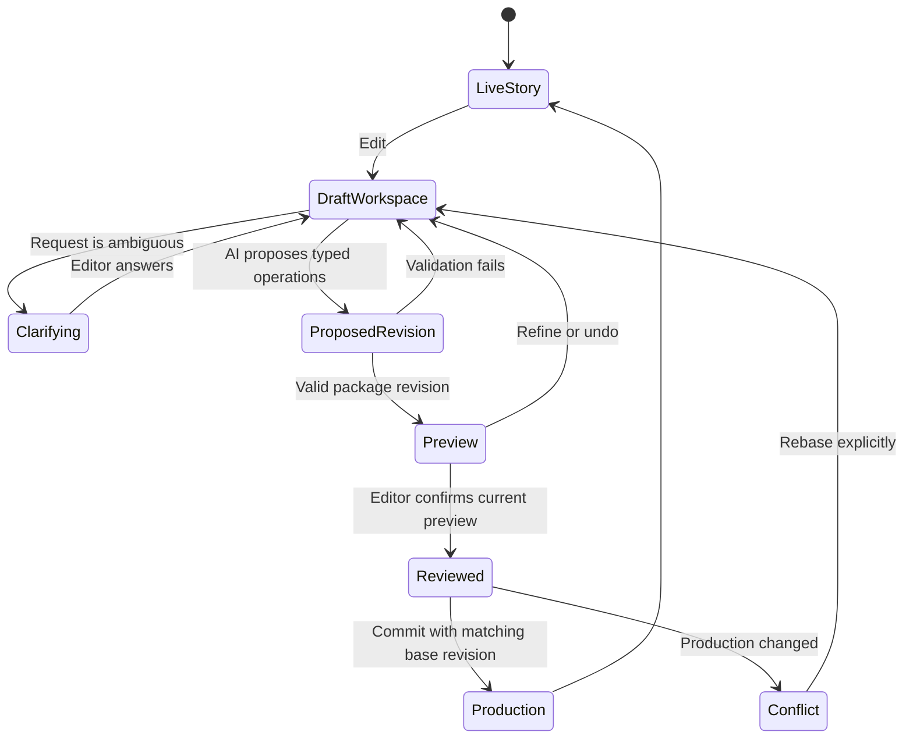
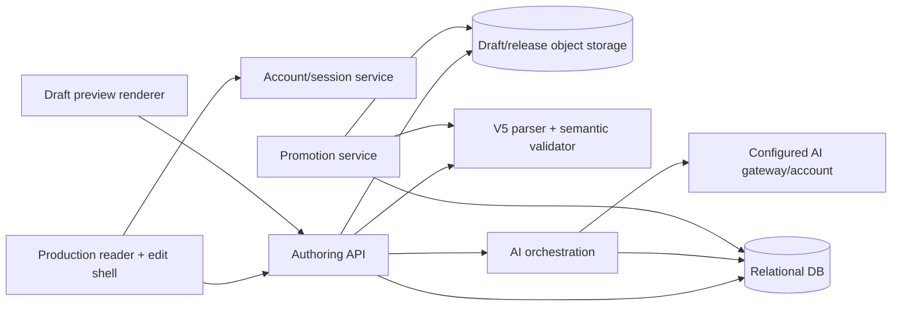

# AI production authoring

Status: approved for phased implementation, 2026-09-28. The namespaced capability
and recommended security architecture were approved; implementation follows the
separate implementation plan.

## Outcome

An authorized editor can open a live story, enter an isolated editing workspace,
ask an AI assistant for changes, upload artwork, inspect every proposed revision in
the real renderer, iterate or undo, and explicitly promote one reviewed revision to
production. The assistant never writes directly to the live package.

The design preserves three boundaries:

1. `story.json` declares that a host may offer AI authoring for the story.
2. Server-side account and story membership decide who may use it.
3. An immutable, validated draft revision is the only object that may be promoted.

## Proposed Story Language extension

Use a namespaced object instead of a root `aiEnabled` boolean:

```json
{
  "storyLanguage": "5",
  "id": "50b19320-50ae-4b77-a449-e3f409cfaef8",
  "title": "The Red Chain",
  "authoring": {
    "ai": {
      "enabled": true
    }
  },
  "body": {}
}
```

`authoring.ai.enabled` is an optional capability declaration. It means a supporting
host may expose an AI editing entry point. It does not identify an AI provider,
contain a prompt, grant access, select a model, set a budget, or make a story
editable by the public. Unsupported hosts may render the story normally without an
editing interface.

This is preferable to `aiEnabled` because future authoring capabilities can remain
under one explicit namespace without accumulating unrelated root flags. It is still
a real Story Language change: the specification, schema, generated types, fixtures,
parser tests and executable contract must change together if it is accepted.

The public reader should show the Edit button only when both conditions hold:

- the story declares `authoring.ai.enabled: true`; and
- the server reports that the current authenticated account can edit this story.

The document flag is never an authorization check. A forged document or request
must not grant access. An unauthenticated reader may either see no button or a
host-owned Sign in to edit affordance; the initial release should show no button to
avoid adding authoring chrome for ordinary readers.

## Author experience



### Entry and workspace

The Edit button is host UI above the story, not a Frame and not part of semantic
reading order. Activating it authenticates the user and creates or resumes a draft
workspace based on the exact current production revision. The live reader remains
available in another tab or behind a clear “Production” link.

The editing surface contains:

- the real Scrolltastic renderer showing the current draft revision;
- an AI conversation with persisted messages and status;
- a compact outline of Container, Panel and Frame IDs/types;
- a “Select in story” mode that highlights rendered Panels and Frames;
- uploaded asset thumbnails and their draft-only paths;
- revision history with undo/restore;
- a JSON/semantic diff and validation diagnostics;
- Preview reviewed and Commit controls that cannot be bypassed.

Renderer-owned `data-panel-id` and `data-frame-id` attributes already provide most
of the selection bridge. Selection UI must be an external overlay and must not alter
story geometry, reading order, ScrollTrigger measurements, or authored JSON.

### Grounding and clarification

Every request is grounded with a server-assembled authoring context:

- the canonical generated V5 schema and concise authoring rules;
- the current draft `story.json`, revision ID and asset manifest;
- a structural outline with stable Container, Panel and Frame IDs;
- the selected element and its immediate parent/siblings;
- relevant, approved story memory;
- current validation diagnostics and supported capability list.

The assistant must resolve an exact target before proposing a mutation. Preferred
resolution order is:

1. explicit UI selection;
2. an exact authored ID named by the editor;
3. one unambiguous match from the structural outline;
4. a concise clarification question with likely candidates.

Examples of required clarification include “the second speech bubble” when several
are visible, “make this image bigger” without a selection, or “add a scene after the
market” when multiple Panels describe a market. For insertion, the assistant must
resolve the parent and the before/after position. For image changes, it must obtain
or propose meaningful alt text and confirm whether the image is decorative.

The model does not return free-form replacement JSON. It calls a small set of typed
authoring tools, for example:

```text
inspect_element(id)
inspect_neighbourhood(id)
list_assets(query?)
propose_patch(base_revision, operations, explanation)
ask_clarification(question, candidate_ids)
propose_memory_update(entries)
```

`propose_patch` uses internal JSON Patch-like operations with `test` preconditions.
It is a host protocol, not Story Language. The server applies it to the immutable
base, rejects protected identity/version changes, parses and semantically validates
the result, verifies all assets, and only then creates a new draft revision. The
model never receives a storage credential or a production commit tool.

Initially, AI edits should be limited to existing V5 capabilities. If a request
needs a new Frame type or authored property, the assistant explains that the
language does not support it; it must not invent JSON that the renderer ignores.

### Images

Image upload is a separate trusted operation, not arbitrary model tool input.

1. The browser requests a short-lived, workspace-scoped upload authorization.
2. The server enforces byte, pixel, file-count and account-storage limits; verifies
   magic bytes and supported SVG/PNG/JPEG/WebP/AVIF formats; strips metadata where
   appropriate; and rejects or sanitizes active SVG content.
3. The upload receives a collision-free draft path under `assets/` or `cards/` and
   records dimensions, aspect ratio, digest, media type, uploader and scan status.
4. The assistant may reference only uploaded assets returned by `list_assets`.
5. Draft media stays private or behind authorized signed delivery. On commit, only
   referenced assets are copied into the immutable release and then the public
   package, with assets promoted before `story.json` as in the existing publisher.

The first release should support user-supplied images, not AI image generation. If
generation is later added, each generation must be persisted immediately with its
prompt, provider/model, usage, cost, safety result and resulting asset provenance.

## Draft, preview and commit contract

A workspace is a durable branch from a production release:

```text
Production release R7
  └─ Workspace W (base R7)
       ├─ Revision D1
       ├─ Revision D2
       └─ Revision D3 (validated, previewed, current)
```

Each draft revision is immutable and stores a complete manifest, document digest,
parent revision, author/generation IDs, validation result and creation time. Assets
may be content-addressed and shared between revisions; the logical package remains
complete. Undo creates or selects another revision rather than mutating history.

Preview uses the production renderer against a draft-only story root. It must show
the exact bytes that would be committed, including responsive layout, animations,
Beats and uploaded media. At minimum the UI offers portrait-mobile and current
viewport previews, validation/accessibility diagnostics, a structural diff and an
asset diff. A JSON diff is available for expert inspection but is not the primary
review surface.

The server records `previewAcknowledgedRevisionId`. Any subsequent prompt, patch,
upload reference, memory-driven edit or revision switch clears that acknowledgement.
Commit is accepted only when:

- the current revision is valid and all referenced assets passed checks;
- the account has `story:publish` permission;
- the account explicitly acknowledged previewing that exact revision;
- usage/account status still permits the operation; and
- the workspace base production ETag still equals the current production ETag.

Promotion reuses the current publish invariant: copy an immutable release first,
promote referenced assets, then conditionally replace `story.json`. A mismatched ETag
returns a conflict. There is no “force” button in the initial browser editor; the
editor must explicitly rebase and preview the regenerated result. The previous
release remains available for rollback and audit.

## Story memory

Story memory is server-side authoring data, not public Story Language and not an
ever-growing transcript pasted into every prompt. It has four sources:

- **approved canon:** characters, places, relationships, chronology and facts;
- **style guide:** voice, spelling, visual conventions, composition rules and
  accessibility conventions;
- **arc and intent:** themes, unresolved threads, planned beats and boundaries;
- **derived index:** summaries and searchable references to current story elements.

Each memory entry has an ID, category, text or structured value, provenance,
confidence, status, scope, creator and source revision. `approved` entries may guide
edits. `proposed` entries are visible for review but cannot silently become canon.
Derived entries are invalidated or regenerated when their source revision changes.

After a conversation, the assistant may propose memory updates with evidence and a
reason. The editor approves, edits or rejects them independently of committing the
story. Sensitive account notes and secrets are prohibited. Retrieval selects only
entries relevant to the current request and records which entry IDs were supplied
to each generation, making behavior auditable and keeping context bounded.

## Accounts, authorization and usage limits

The current GitHub publisher allow-list is suitable for a small publishing MVP but
is not enough for multi-user production authoring. Introduce authenticated accounts,
organizations and explicit story memberships:

| Role | Read draft | Prompt AI | Upload | Commit production | Manage memory/members |
| --- | ---: | ---: | ---: | ---: | ---: |
| Viewer | yes | no | no | no | no |
| Editor | yes | yes | yes | no | propose only |
| Publisher | yes | yes | yes | yes | approve memory |
| Owner | yes | yes | yes | yes | yes |

Server-side account configuration selects the allowed gateway/provider models and
sets hard limits for requests per minute, concurrent generations, input/output
tokens, daily/monthly spend, image uploads, draft storage and active workspaces.
Before each generation, atomically reserve estimated budget; after completion,
reconcile actual provider usage and cost. A failed or cancelled call is still logged
and reconciled. Exceeding a hard limit stops before provider invocation and gives a
clear reset date or administrator action. No client-provided usage number is trusted.

Provider credentials remain server-side. Route model calls through one configured
gateway/account so keys, provider failover and cost policy are centralized. Persist
every generation before calling the model, then store status, model, prompt/context
digests, tool calls, output, token usage, estimated/actual cost, latency, user,
workspace and resulting revision. Streaming output is never client-only state.

Security controls include:

- secure HTTP-only sessions, CSRF protection and strict origin checks;
- authorization on every story, workspace, revision, message and asset query;
- short-lived upload grants bound to account, story, workspace, path and limits;
- server-side schema/tool validation and output-size/tool-step limits;
- prompt-injection boundaries: story text and images are untrusted content, never
  instructions with authority, and cannot expand tool permissions;
- rate limiting, concurrency limits, audit logging and anomaly/abuse controls;
- encryption in transit and at rest, retention/deletion policy and redacted logs;
- content security policy and no story-provided script/style/model URLs;
- accessible dialog focus management, keyboard operation and reduced motion.

## Suggested persistence model

Use a relational database for authorization, concurrency, memory, history and usage;
use object storage for immutable package files and uploaded assets.

| Record | Important fields |
| --- | --- |
| `accounts` / `organizations` | identity, status, plan, limits, billing period |
| `story_memberships` | story ID, principal, role |
| `production_releases` | release ID, story ID, ETag, manifest, actor, timestamp |
| `draft_workspaces` | workspace ID, story ID, base release/ETag, owner, status |
| `draft_revisions` | revision ID, parent, manifest/digest, validation, generation ID |
| `conversations` / `messages` | workspace, durable ordered UI messages |
| `generations` | preallocated ID, model, status, usage/cost, context/tool audit |
| `story_memory` | category, value, provenance, approval, source revision |
| `assets` | digest, logical path, dimensions, scan/provenance, storage key |
| `usage_ledger` | reserved and actual units/cost, account, generation, period |
| `audit_events` | actor, action, target, before/after IDs, IP/session metadata |

All externally visible IDs are opaque. Database transactions enforce membership,
budget reservation, revision ancestry and commit preconditions. Blob names alone are
not treated as authorization.

## Service boundaries



The AI orchestration layer should use structured outputs/tool calls through the AI
SDK, but the SDK must not own domain invariants. Authoring tools call ordinary typed
application services that can be unit-tested without a model. The production
promotion service remains narrow and has no prompt endpoint.

Suggested addressable resources and APIs:

```text
/s/:storyId                         production reader
/s/:storyId/edit/:workspaceId       durable editor/conversation
/s/:storyId/edit/:workspaceId/r/:revisionId   exact preview

POST /api/stories/:id/workspaces
POST /api/workspaces/:id/generations
POST /api/workspaces/:id/uploads/prepare
POST /api/workspaces/:id/revisions/:revisionId/preview-ack
POST /api/workspaces/:id/commit
GET  /api/generations/:generationId
```

Mutations require idempotency keys. Generation, upload and commit status must remain
retrievable after refresh, disconnect or retry.

## Failure and conflict behavior

- Invalid AI output creates no revision; retain the generation and show diagnostics.
- A valid but undesirable result remains a draft and can be undone or refined.
- A disconnected stream resumes from persisted messages/generation status.
- An upload that is unreferenced remains draft-only and is garbage-collected after
  the retention period; it never leaks into production.
- If production changes, commit fails closed. Rebase runs the draft operations or a
  reviewed merge against the new base, then requires validation and preview again.
- If promotion fails before the conditional `story.json` write, production readers
  continue using the old document. Immutable release data supports investigation.
- Quota exhaustion never falls back to an unconfigured model or personal key.

## Delivery sequence

1. Approve and specify `authoring.ai.enabled`; update the V5 specification, schema,
   types, examples and tests without adding UI yet.
2. Add accounts, story membership, production release records and audit events;
   migrate the existing publisher authorization to the same policy.
3. Implement durable workspaces/revisions, protected draft assets, exact preview and
   conditional promotion without AI. This proves the safety boundary first.
4. Add element selection, outline, diff, preview acknowledgement, undo and conflicts.
5. Add uploads with validation/quarantine and draft preview delivery.
6. Add persisted AI conversations and read-only inspection/clarification tools.
7. Enable typed patch proposals, strict validation and revision creation behind
   per-account feature flags and low quotas.
8. Add reviewed story memory, retrieval auditing and usage/cost dashboards.
9. Expand rollout only after adversarial authorization, prompt-injection, concurrency,
   accessibility, mobile preview and rollback tests pass.

## Acceptance criteria

- An anonymous user cannot discover or mutate drafts, even with a known story ID.
- Enabling the document flag alone grants no editing or model access.
- Every AI call, patch, upload, preview acknowledgement and commit is attributable.
- The assistant asks when a target is ambiguous and cannot patch an unresolved ID.
- Every created revision passes the same V5 validator used by production publishing.
- No draft revision can become live until that exact revision was previewed and
  acknowledged by a publisher/owner.
- Concurrent production changes cause a conflict, never silent overwrite.
- Production promotion is atomic from the reader's perspective and rollbackable.
- Story memory is versioned, scoped, reviewable and traceable to prompt generations.
- Hard account limits stop usage before overspend and all actual usage is reconciled.
- Uploaded files cannot escape package paths or introduce executable story content.
- Continuous scrolling, authored Beats, accessibility and reduced motion work in
  both draft preview and the final production package.

## Decisions required before implementation

1. Approve `authoring.ai.enabled`, choose a different name, or keep enablement wholly
   host-side. The recommended option is the namespaced declaration plus server policy.
2. Choose the account/organization identity provider and initial owner migration for
   already-published stories.
3. Choose the relational database and protected draft-object storage implementation.
4. Define initial account limits, retention periods and who may approve story memory.
5. Decide whether unauthenticated readers see no Edit button or a Sign in affordance.
6. Confirm that the first release accepts uploaded images only and does not generate
   new images.
