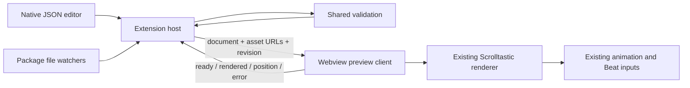

# Scrolltastic for VS Code — extension design

Status: MVP implemented, 2026-09-25. The first edit/preview increment is in
`extensions/vscode/`; validation and autocomplete remain later iterations.

## Product

A local story-authoring workspace: edit ordinary Story Language JSON, add artwork
to its package, and see the actual Scrolltastic output beside the editor.

The first release delivers the edit → preview loop. Later releases add integrated
validation and autocomplete. The story remains the portable JSON document plus
its assets, with no editor-only properties added to the language.

```text
VS CODE
┌─────────────────┬────────────────────────┬──────────────────────────┐
│ Explorer        │ story.json             │ Scrolltastic Preview     │
│                 │                        │                          │
│ <story-id>/     │ {                      │   rendered story         │
│   story.json    │   "storyLanguage": "5",│   native scrolling       │
│   assets/       │   ...                  │   Card/Mask transitions  │
│     scene.webp  │ }                      │   authored Beat controls │
│   cards/        │                        │                          │
├─────────────────┴────────────────────────┴──────────────────────────┤
│ Preview: up to date / updating / paused / showing last valid story │
└────────────────────────────────────────────────────────────────────┘
```

Use the standard JSON editor and Explorer with a separate WebviewPanel. Keep
normal save, undo, search, formatting and source control behavior. This matches
VS Code's webview model for custom previews. [Webview API](https://code.visualstudio.com/api/extension-guides/webview)

## First-release experience

The current implementation includes the commands and live preview described
below, a generated standalone AJV validator, package-scoped webview asset URLs,
and VS Code launch configuration. It has unit coverage for safe package paths
and all committed V5 reference stories. The extension host/webview lifecycle
still needs verification in the Extension Development Host before distribution.

1. Open a folder containing a story package, or run **Scrolltastic: New Story**.
   The command creates a new UUID folder, `story.json`, `assets/` and `cards/`.
   It never overwrites an existing package.
2. Open `story.json` and run **Scrolltastic: Open Preview to Side**. The preview
   stays bound to that document even when another editor gains focus.
3. Edit JSON. The preview uses the open text buffer, including unsaved changes,
   after a short debounce. Saving is not required for text updates.
4. Drop or copy image files into `assets/` or `cards/` using Explorer or the OS.
   Reference them in JSON, for example `"src": "assets/scene.webp"`. Adding an
   unreferenced file makes it available; it does not invent a Frame or alter JSON.
5. Replace an image under the same filename. The preview reloads it automatically.
   Deleting a referenced image shows its missing state; restoring it repairs the view.
6. Scroll through the story and use its authored controls. Editing does not reset
   the preview to the beginning. **Restart Preview** explicitly returns to the top.

Commands:

| Command | Behavior |
| --- | --- |
| New Story | Create a minimal valid V5 package in a selected parent folder |
| Open Preview to Side | Open or reveal the preview bound to the current story |
| Refresh Preview | Resend the current buffer and refresh asset revisions |
| Pause/Resume Live Preview | Hold the current view while making a larger edit |
| Restart Preview | Cancel assistance and return to the beginning |
| Copy Story Asset Reference | Copy a selected package asset's relative `src` path |

Add editor-title actions for preview, refresh and pause. Use the native status bar
for update state and actual viewport dimensions, avoiding extra page chrome that
changes story geometry. Repeated Open Preview commands reuse the same panel.
Different stories may have independent previews, keyed by document URI, not UUID.

Untitled JSON must be saved into a package before opening a preview. A local
package root is the directory containing `story.json`; it need not be named after
the UUID while authoring. Public reader URL identity rules remain unchanged.

## Live update contract

Suggested initial policy: 300 ms debounce for text edits and 150 ms coalescing for
asset events. These are extension settings, not Story Language fields.

- Read `TextDocument.getText()` as the authoritative source for an open document.
  Asset changes must not replace dirty text with the saved disk copy.
- Treat saves, undo/redo, external reloads, create/change/delete events and folder
  renames as updates. Avoid duplicate renders when save follows the same text edit.
- Validate each candidate with the existing parser before mounting it. On temporarily
  invalid JSON, retain the last valid document and clearly mark the preview stale.
  Show a concise error and JSON path; show an error page if no valid render exists.
- Warnings do not prevent preview. Initial preview feedback is not the later Problems
  panel/IntelliSense feature; rendering already requires validation today.
- Attach animations only after `handle.ready`. Reuse the existing animation and
  navigation code; do not create a second interpretation of Cards, Masks or Beats.
- Start with a complete remount per accepted update. DOM patching is deferred until
  measurements demonstrate a need. The renderer already provides lifecycle cleanup.
- Before replacing a scene, cancel pending input/assisted movement, destroy controls,
  then animations, then the mount. Restore the last accepted snapshot if construction
  fails. Do not run two sets of ScrollTriggers as a staging mechanism.
- Track a monotonically increasing revision per preview, covering both text and
  assets. Older validation, stat, readiness or image work cannot replace newer state.
- Preserve the current real `scrollY`, clamped after layout settles. If the reader
  was resting exactly at a surviving Beat, prefer its recalculated destination.
  Free-scrolling positions must not snap merely because a preview updated.
- Restore by moving document scroll, never by directly setting GSAP timeline progress.
  Recheck after relevant layout changes only until the first new user interaction.
- While paused, remember only the newest candidate. Hidden/recreated webviews request
  the latest buffer again and restore lightweight saved position/state.

## Architecture



The host owns document binding, file access and editor commands. The webview owns
DOM, animation and scrolling. Messages are typed and validated at both ends; they
carry data, never executable source or arbitrary commands.

Proposed messages:

```ts
type HostMessage =
  | { type: 'render'; revision: number; document: NormalizedStory;
      assets: Record<string, string> }
  | { type: 'invalid'; revision: number; diagnostics: ValidationDiagnostic[] }
  | { type: 'restart' };

type PreviewMessage =
  | { type: 'ready' }
  | { type: 'rendered'; revision: number }
  | { type: 'position'; revision: number; scrollY: number; beatId?: string }
  | { type: 'error'; revision: number; message: string };
```

Persist only small session state, not the whole story or asset bytes. Use webview
state restoration rather than keeping every hidden story alive indefinitely.
The HTML shell is loaded once; edits arrive as messages. Restrict local resources
and use a content security policy. [Webview API](https://code.visualstudio.com/api/extension-guides/webview)

### Reuse and necessary renderer changes

| Existing code | Extension use / required work |
| --- | --- |
| `src/schema/story.schema.json` | Remains the single language schema |
| `src/parser/parse.ts` | Shared renderability and semantic validation |
| `src/renderer/mount.ts` | Mount and destroy the real story |
| `src/animation/reveals.ts` | Attach/destroy existing GSAP behavior |
| `src/inputs/controls.ts` | Preserve authored navigation policy |
| `src/assets/resolve.ts` | Add a host asset-resolution adapter |
| `src/reader/main.ts` | Do not import this entrypoint: it owns website routing |
| `src/reader/reader.css` | Extract reusable reader-shell/control styles from landing-page styles |

Two integration changes are required before the first preview:

**Asset transport.** Current `resolveAsset` expects an HTTP(S) package base without
a query. Extract its package-path validation and allow a trusted host-supplied
asset resolver at mount time, with HTTP resolution retained for the website.
The host validates each authored reference, resolves its workspace URI and creates
an explicit webview URL map. The preview resolver accepts only entries in that map.
No asset URL is substituted into authored JSON.

Use `asWebviewUri` with tightly scoped `localResourceRoots`. Append host-controlled
cache revisions to transport URLs when file contents change; queries remain invalid
in Story Language `src`. This is an implementation adapter, not a language extension.
[Webview resource loading](https://code.visualstudio.com/api/extension-guides/webview#loading-local-content)

**Validator compilation.** The parser currently compiles AJV at module load.
A restrictive webview script policy must not require `unsafe-eval`. Generate an
AJV standalone validator at build time and import it from the shared parser. Check
its generated output alongside the existing generated TypeScript and verify parity
with current semantic checks. AJV explicitly supports build-time standalone code
for restrictive browser policies. [AJV standalone validation](https://ajv.js.org/standalone.html)

Do not weaken the webview policy to accommodate runtime validator compilation.
Bundle the renderer, GSAP, validator and CSS into the extension; authors should not
need the Scrolltastic source repository, npm installation or a running Vite server.

### Preview viewport

For the MVP, the webview window is the actual story viewport. Authors resize the
editor column; the preview reports its CSS-pixel dimensions. This preserves the
engine's current `window.scrollY`, `innerHeight`, viewport units and pinning behavior.

A narrow `max-width` container inside a desktop webview is not phone emulation:
`vw`, `svh`, media queries and ScrollTrigger would still see the outer window.
Exact phone/tablet presets should follow in a separate increment using an isolated
browsing context with the requested viewport dimensions. Prove local resources,
CSP and scrolling in that context before committing to it. Previewing in Electron
also does not replace physical Safari/Android testing.

### Asset watching and limits

Watch the active package's `story.json`, `assets/**` and `cards/**`, with subscriptions
shared where multiple previews use the same folder. Dispose watches when no longer
needed. Use URI-aware `workspace.fs` access and relative watchers, avoiding assumptions
about the OS path separator. [VS Code API](https://code.visualstudio.com/api/references/vscode-api#workspace)

Maintain a lightweight asset index for watched packages, reusable by future completion
providers. Stat/read only referenced or changed files; do not repeatedly scan all
workspace images. Debounce large copy operations and retry transient file-in-progress
failures once; a persistent missing/invalid file remains visible as a diagnostic.

Accepted names/extensions follow the current schema: safe path segments under
`assets/` or `cards/`, with SVG/PNG/JPEG/WebP/AVIF. Spaces, uppercase extensions and
unsupported media do not silently become valid. Explain the required rename instead
of silently changing files. A future Import Asset command can offer safe naming and
explicit collision handling.

Restrict media access to the selected package; reject traversal and symlink escape.
Display SVG only as an image, never embed its contents into the preview DOM. Story
strings never enter the HTML shell, scripts or styles as markup. Do not start tasks,
execute workspace code, fetch remote packages or access unrelated workspace files.

Scripts come from the bundled extension. The CSP should prohibit inline scripts and
evaluation; accommodate the renderer's programmatic layout styles deliberately and
test that policy with GSAP. No arbitrary story-provided style/script URLs are allowed.

## Later iteration: editor validation

Keep native JSON syntax diagnostics. Add language-specific feedback in two layers:

1. **Schema support:** properties, enums, types, required fields, descriptions and
   standard hover/completion through VS Code's JSON facilities.
2. **Semantic support:** run the shared validator for duplicate IDs, unknown Beat
   targets, Card geometry/range conflicts and accessibility warnings. Add package
   checks such as missing assets and invalid references.

VS Code supports workspace JSON schema associations without changing documents.
[JSON schema support](https://code.visualstudio.com/docs/languages/json#json-schemas-and-settings)

Proposed opt-in command: **Enable Story Language Support in This Workspace**.
It associates only chosen story paths, not every file named `story.json` on the
machine. For an offline first implementation, write a generated copy of the bundled
schema under `.vscode/scrolltastic/` and a scoped `json.schemas` setting. Treat that
copy as a managed build artifact, refreshed from the canonical schema, never edited
as a second language definition. Do not add `$schema` to authored stories: the
current strict schema does not accept that property.

Map diagnostic JSON Pointer paths to source ranges with a JSON syntax tree. Keep
strict JSON acceptance even if the location parser can read JSONC. Publish semantic
results using a DiagnosticCollection; suppress duplicate structural messages already
reported by the JSON language service. Missing properties underline the containing
object; unknown properties underline their key. Diagnostic actions must verify the
current document version before applying edits.

Errors prevent a new render; authoring/accessibility warnings do not. Later quick
fixes can insert required fields or repair references, but must not invent meaningful
alt text or silently label meaningful artwork decorative.

## Later iteration: autocomplete and navigation

| Completion | Source |
| --- | --- |
| Frame types, property names, enums and documentation | Canonical JSON Schema |
| `src` paths | Package asset index, filtered by valid paths |
| Root Beat `target` | Current unsaved document's Panel/Frame IDs |
| Speaker names | Existing speakers in the current story |
| Narrative/Dialogue/Image/Card/Mask snippets | Tested canonical examples |

Use a small completion provider only for context that the schema cannot express.
Then add Go to Definition for asset/Beat references and a Body/Container/Panel/Frame
outline. Preserve the JSON language mode. A dedicated language server is unnecessary
until performance or support for other editors provides a concrete reason.

## Repository and distribution

```text
extensions/vscode/
  package.json                 commands, supported VS Code range, build hooks
  src/extension.ts             activation and disposal
  src/preview-manager.ts       document-to-panel binding
  src/story-session.ts         revisions, updates and last-valid state
  src/package-assets.ts        URI resolution, asset index and watches
  src/messages.ts              validated host/webview protocol
  webview/main.ts              shared renderer and lifecycle orchestration
  test/                       extension-host integration tests

src/assets/                    shared path validator and host adapter
scripts/                       generated standalone validator
```

Keep shared runtime code under the current `src/` initially; the extension build
bundles it directly. Do not copy the renderer or introduce a monorepo framework.
Package a self-contained VSIX for local installation first. Publishing to the VS
Code Marketplace is a separate release action.

First support target: desktop VS Code with local folders. Use URI-safe APIs from
the beginning so Remote SSH, WSL and Codespaces can be tested next. Do not claim
remote/virtual/browser-workspace support merely because local tests pass. File
providers need not expose ordinary local paths. [Virtual workspace guidance](https://code.visualstudio.com/api/extension-guides/virtual-workspaces)

Proposed workspace-trust policy: support read-only preview using bundled code;
disable package creation/configuration writes in Restricted Mode. Declare and test
that policy in the extension manifest. [Workspace trust guidance](https://code.visualstudio.com/api/extension-guides/workspace-trust)

## Implementation sequence and acceptance

| Increment | Deliverable | Exit criteria |
| --- | --- | --- |
| 0 — integration proof | One packaged reference story in a webview | Assets, strict CSP, standalone validator, reversible Card FIT and Mask transitions work without a dev server |
| 1 — MVP | Commands, unsaved-buffer preview, asset watching and state | Text/image edits refresh; invalid text retains a clearly stale view; no stale async result wins; scroll/focus and teardown work |
| 2 — validation | Scoped schema association and Problems integration | Correct ranges and severities; semantic/package checks; unrelated JSON untouched |
| 3 — completion | Assets, Beat targets, speakers and snippets | Suggestions reflect unsaved JSON and file changes; inserted snippets validate |
| 4 — authoring refinement | Exact viewport presets, source/preview linking, import tools | Accurate viewport-dependent geometry and explicit, undoable authoring edits |

MVP integration tests must cover two open stories with identical asset filenames,
unsaved text versus disk edits, malformed JSON and recovery, replace/delete/re-add
artwork, rapid update races, slow image loads, window resizing, reduced motion,
pinned timelines, hidden/reopened panels and disposed watchers/controllers.

Run renderer unit/browser regressions after shared API changes. Use VS Code's
Extension Development Host for the actual editor/webview/resource boundary and test
an installed VSIX in a workspace containing only stories. A normal browser harness
alone cannot prove webview resource URLs, CSP or editor lifecycle correctness.

Planning baseline: the existing 53 unit tests and production build pass. No
extension code currently exists. The integration gaps identified above are the
HTTP-specific asset resolver and runtime AJV compilation, not missing rendering
capabilities. Existing browser tests were not rerun for this design-only task.
